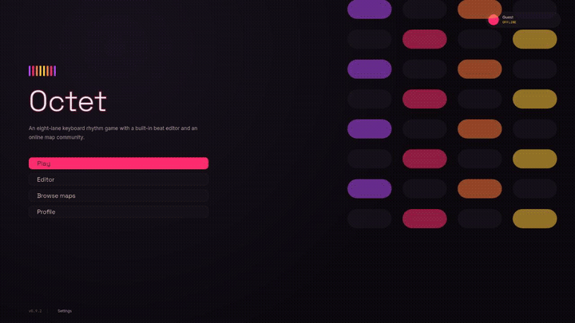
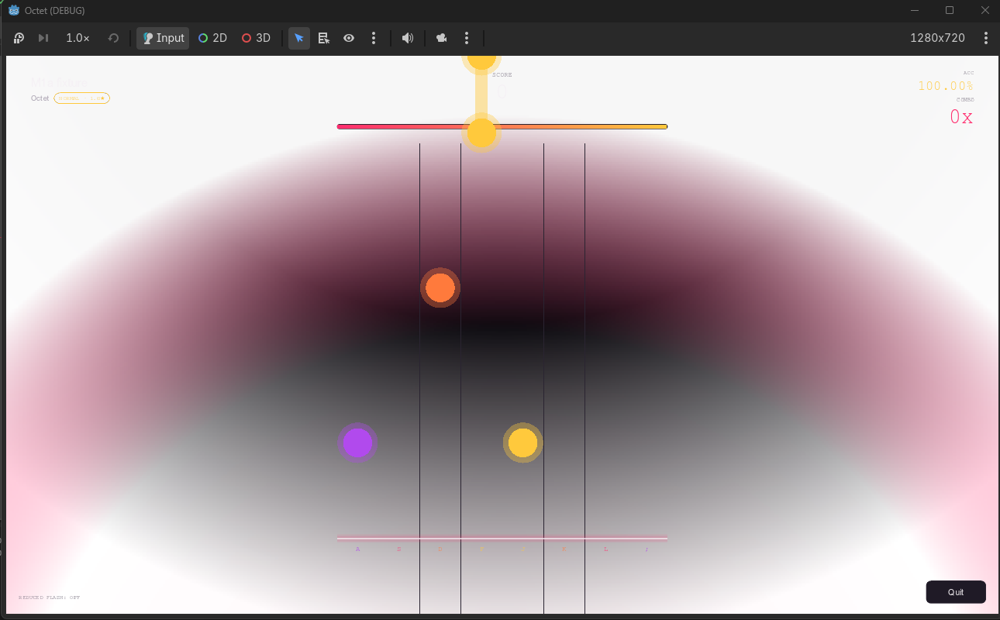
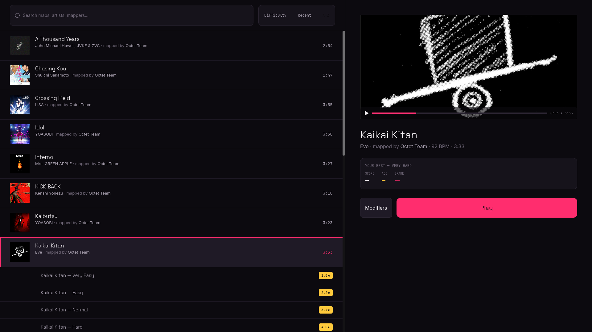
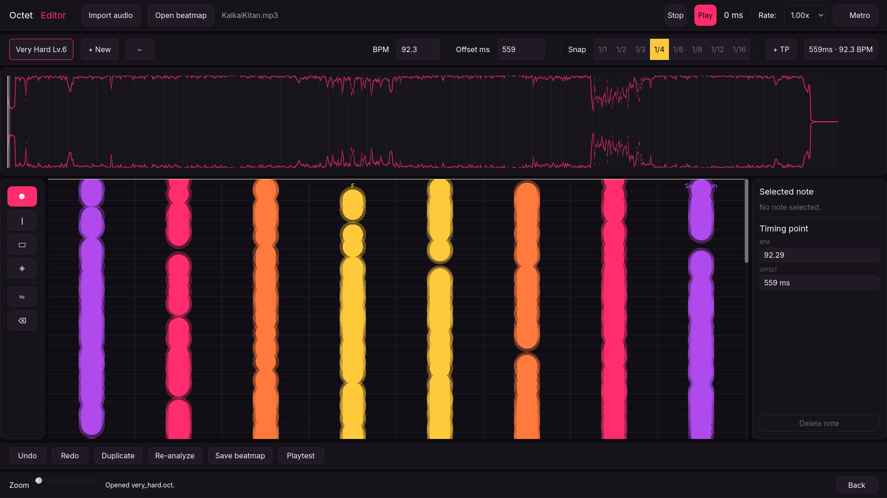
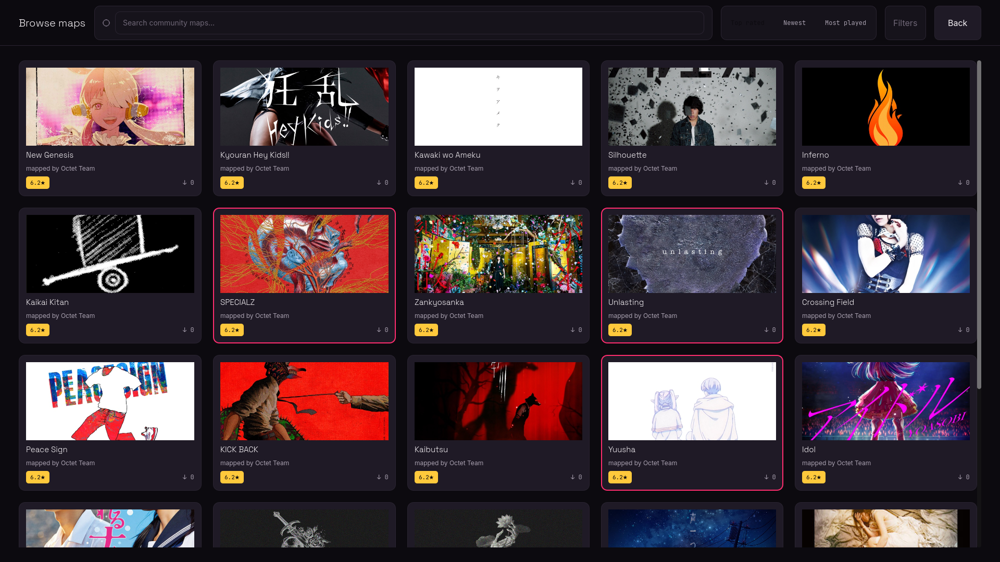
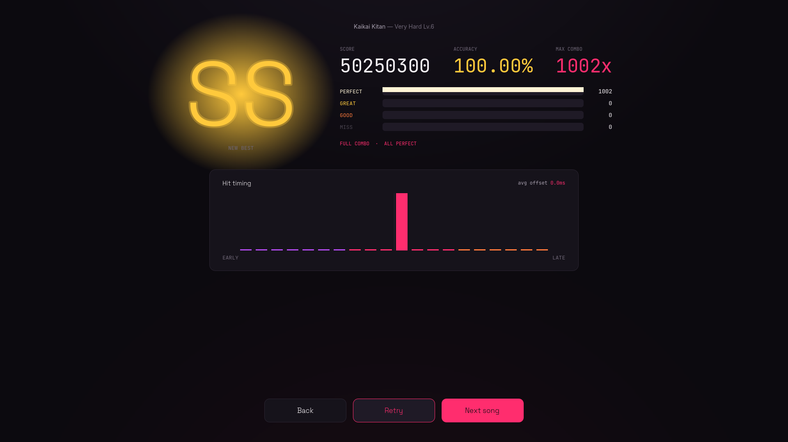

# Octet

**A fast, eight-lane keyboard rhythm game — drop in any song and play.**

---

Notes fall down eight lanes mapped to your home row (`A S D F` / `J K L ;`), and you hit them the instant they cross the line. Drop in any song and the built-in editor finds the tempo and beats for you automatically, so mapping is placement, not hand-syncing by ear. Browse and play community-made maps from the Map Hub, right in the client.

## See it in action

| | |
|---|---|
|  **Gameplay** — eight-lane play with live combo, accuracy, and health. |  **Song select** — browse the library, preview a track, pick a difficulty. |
|  **Editor** — automatic BPM/beat detection, waveform, and beat-grid. |  **Map Hub** — browse and download community-made maps. |

**Results** — grade, accuracy, combo, and a hit-timing breakdown.

## Why you'll like it

- **Eight-lane play** on the home row, with taps, chords, and holds, tiered timing windows, and letter grades.
- **The editor maps songs for you** — automatic BPM and beat detection, then snap-to-grid placement on top of a waveform and beat-grid overlay.
- **Map Hub** — browse, search, and download community-made maps and play them straight from the client.
- **Tight sync** — an audio-driven clock and a per-machine calibration screen keep hits feeling right on your setup.

## Controls

| Lane | 1 | 2 | 3 | 4 | 5 | 6 | 7 | 8 |
|------|---|---|---|---|---|---|---|---|
| Key  | A | S | D | F | J | K | L | ; |

All keys are rebindable. Scroll speed, offsets, and accessibility options live in Settings.

## Download

Grab a native build for your platform from [Releases](../../releases) (`v1.1.0`):

- **Windows** — extract `Octet-v1.1.0-windows-x64.zip`, run `Octet.exe`.
- **macOS** — extract `Octet-v1.1.0-macos-universal.zip`, open `Octet.app`.
- **Linux** — extract `Octet-v1.1.0-linux-x86_64.zip`, run `./Octet.x86_64`.

First-launch notes (unsigned builds)

- **Windows** — SmartScreen will warn on first launch: **More info → Run anyway**.
- **macOS** — un-notarised, so Gatekeeper blocks a plain double-click. Before first launch, run `xattr -dr com.apple.quarantine Octet.app`, then open normally.
- **Linux** — make it executable first: `chmod +x Octet.x86_64`.

Each release includes a `SHA256SUMS.txt` to verify your download.

## Under the hood

Octet is built in Godot 4.7 (pure GDScript, including a hand-rolled audio-analysis FFT). Map Hub runs today as plain files served from this repo — no backend yet. More detail, if you want it:

- [`ARCHITECTURE.md`](ARCHITECTURE.md) — how the systems fit together
- [`CONTRIBUTING.md`](CONTRIBUTING.md) — build from source, run tests, dev conventions
- [`CHANGELOG.md`](CHANGELOG.md) — release history
- [`docs/PROJECT_BRIEF.md`](docs/PROJECT_BRIEF.md) — full design and technical spec, including the `.octet`/`.oct` map format
- [`docs/DESIGN_BRIEF.md`](docs/DESIGN_BRIEF.md) — visual identity and screens
- [`docs/CODEMAPS/`](docs/CODEMAPS/) — architecture, gameplay, editor, UI, and data codemaps

**Roadmap:** shipped — full gameplay, editor with auto BPM/beat detection, and Map Hub browse/download (M1–M3, through v1.1.0). Next up — accounts, real map publishing, and leaderboards (M4), then community features and signed installers (M5).

